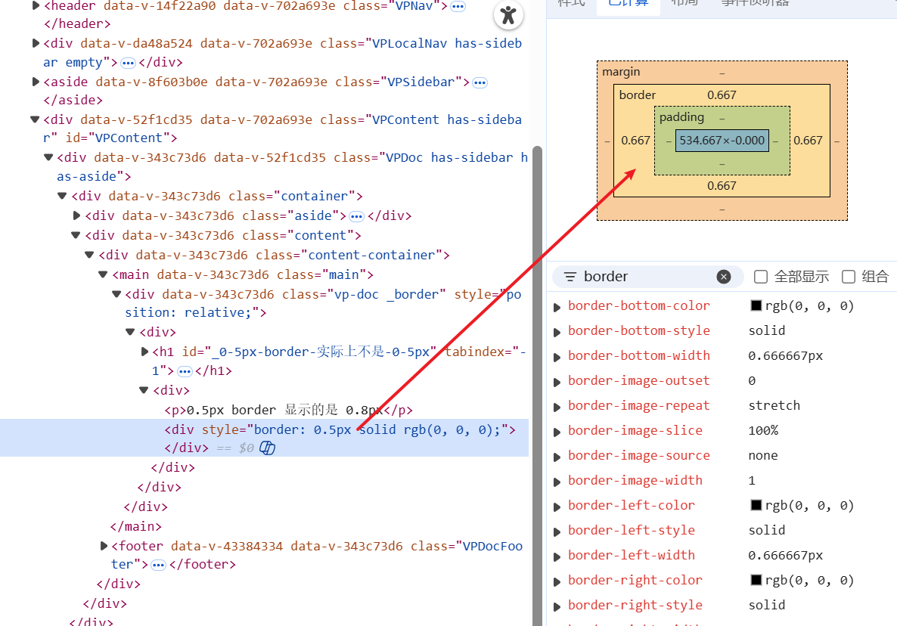

# 0.5px border 实际上不是 0.5px

点击展开/折叠代码

<<< @/components/border.vue

<border />

## 原因

我查资料之后大概结论如下，px 是逻辑像素，屏幕本身是由物理像素的。例如 200 * 200 的屏幕显示 100 * 100 的内容 1px 就是 2 物理像素。0.5px 就是 1 物理像素。显示内容变成 200 * 200, 1px 就是 1 物理像素。0.5px 还是 1 物理像素。因为物理像素是没法分割的。这里有个概念是设备像素比，物理像素/逻辑像素=设备像素比【dpr】.比如我的电脑 dpr 是 1.5， 0.5 逻辑像素对应的物理像素就是 1.5 * 0.5 = 0.75 ≈ 1 ，1 物理像素对应的就是 0.667 逻辑像素。

看到这里你有第二个疑问，为啥 border 是 0.5px 变成了 0.667px。而 height 是 0.5px 最终还是 0.5px 呢，这是因为浏览器对「线条渲染」和「盒子尺寸」的处理逻辑存在差异，同时受限于屏幕物理像素的特性。在处理「盒子尺寸」的时候会引入抗锯齿概念来模拟 0.5px 的效果。

## 什么是抗锯齿？
抗锯齿用来细分物理像素，比如咱们画直线看起来没有违和感，要是画斜线，因为屏幕是一个一个的正方形的点，他就会有锯齿形状，为了消除这种情况就有了亚像素的概念，也是上面问题产生的原因之一

### 亚像素

对于 rgb 屏幕来说一个物理像素是由红绿蓝三个小灯组成的，那我再展示一些特殊情况的时候我不让三个小灯按照正常色全量，而是显示一下渐变效果就能够消除锯齿感

